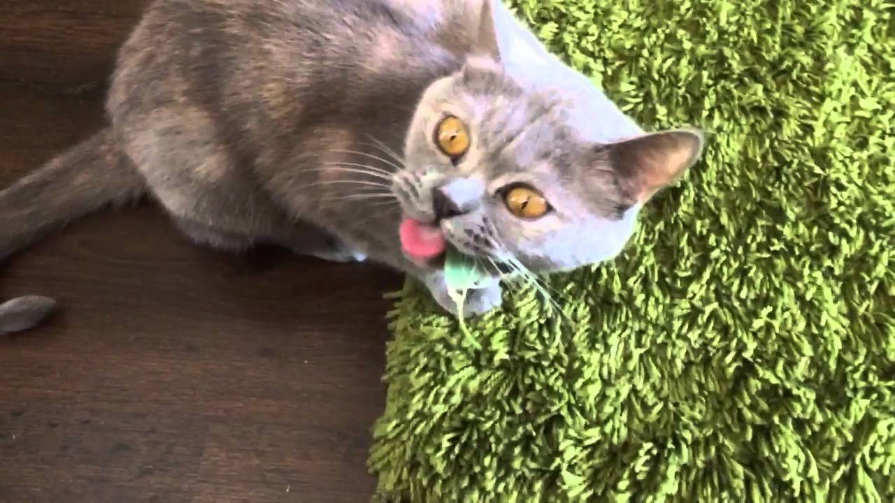

# julien

# WELCOME TO THE CAT WORLD

## A little tour in the hairy little beasts world

We all love our little beasts except the _allergic_ person.  
And we are all ready to do **everything** for them.

What to think about when you have a cat:
* feed it
* change it litter box
* pet it
* open the window


How to change the litter box:
1. take all the shit out of the box
2. put some new litter gravel
3. throw your cat through the window
4. your house is now cat free


If you [click here](https://www.thesprucepets.com/is-marijuana-toxic-to-cats-555055), you will find many information's concerning your favorite animal.


And as many cats say : 
> MEOW !

```html
<html>
<head></head>
<body></body>
</html>
```


```javascript
function test() {
 console.log("look ma’, no spaces");
}
```
www.google.de


internal links

[Julia](../../../julia)

# Anchors in markdown

[link to an anchor](#anchors-in-markdown)



:zzz:

:middle_finger:

# checkboxes

- [x] buy a cat
- [x] feed im
- [ ] make him fly